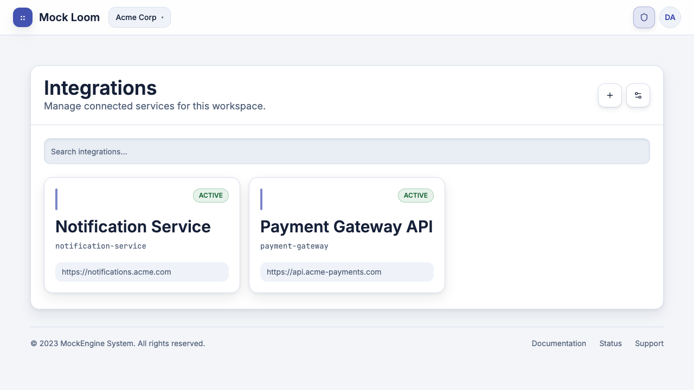
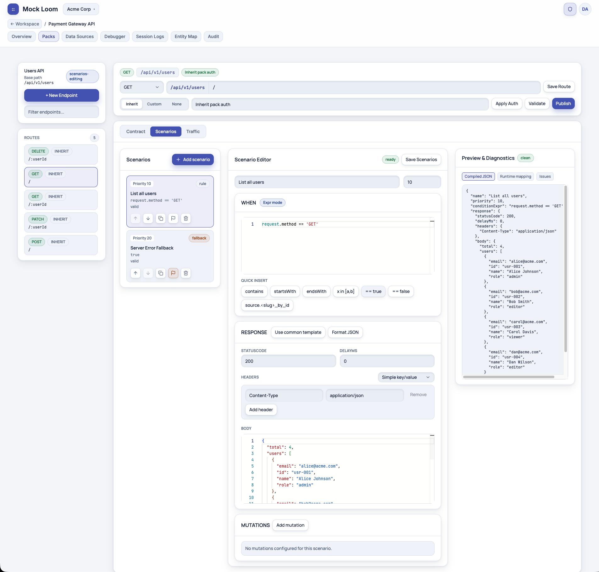
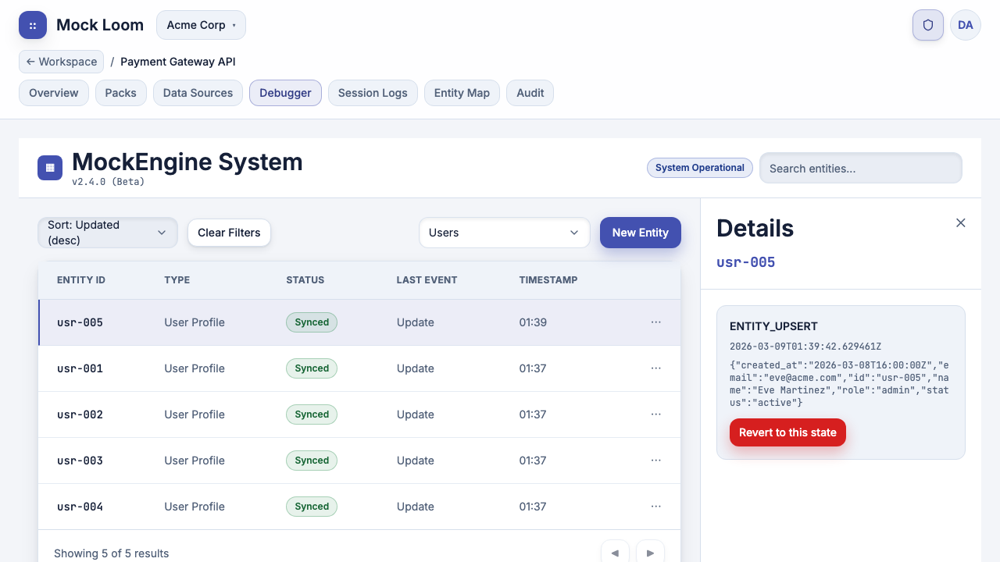
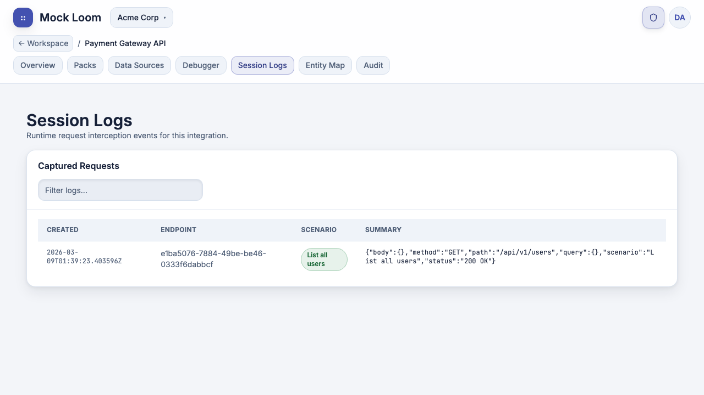
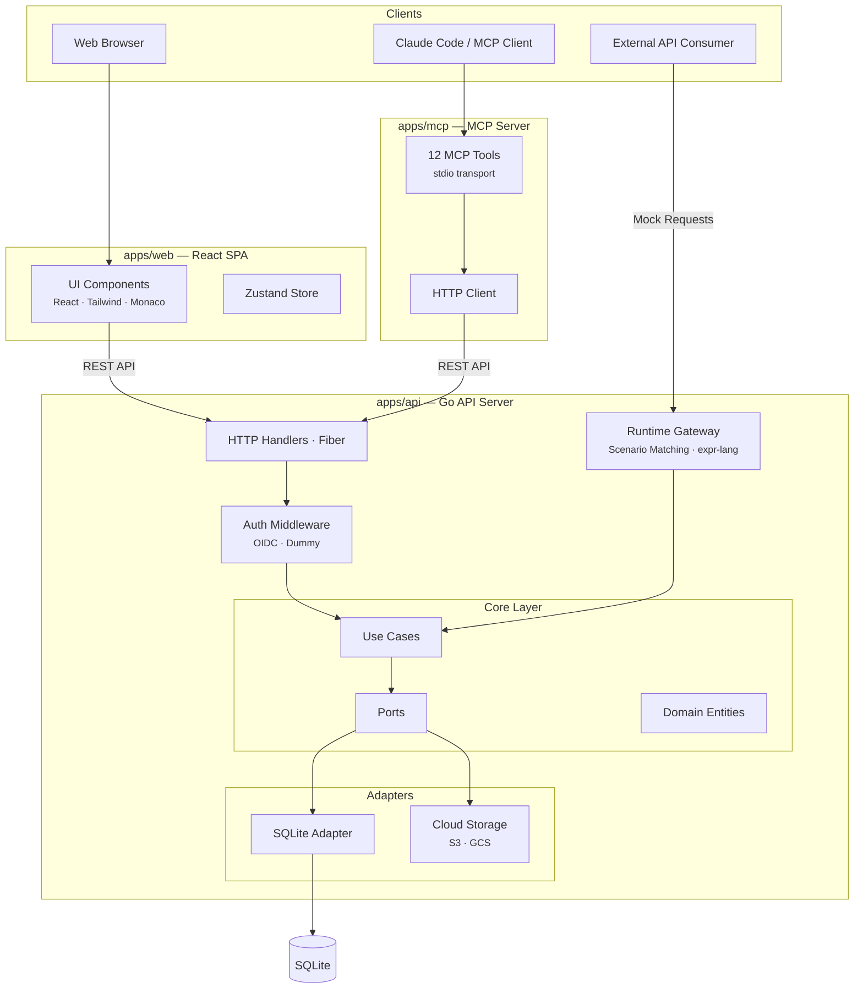
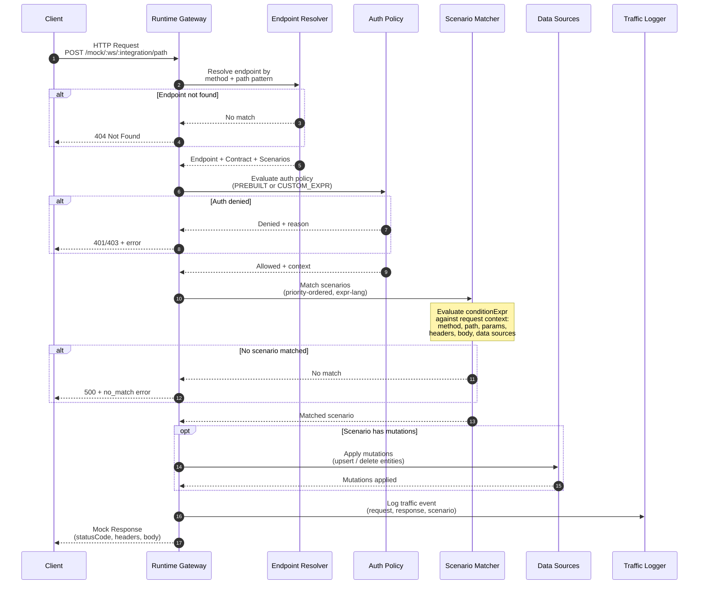

<p align="center">
  
</p>

<p align="center">
  <a href="#getting-started"><strong>Getting Started</strong></a> ·
  <a href="#architecture"><strong>Architecture</strong></a> ·
  <a href="#how-it-works"><strong>How It Works</strong></a> ·
  <a href="#mcp-integration"><strong>MCP Integration</strong></a> ·
  <a href="packages/contracts/openapi/mock-loom.v1.yaml"><strong>OpenAPI Spec</strong></a>
</p>

<p align="center">
  
  
  
  
  
</p>

---

## What is mock-loom?

**mock-loom** is a rule-based API mocking engine that goes beyond static response stubs. It provides **stateful behavior**, **dynamic scenario matching** using [expr-lang](https://github.com/expr-lang/expr), and **entity-level rollback** through event sourcing — all managed through a workspace-based multi-tenant architecture.

Instead of writing throwaway mock servers, you define **contracts**, **priority-ordered scenarios**, and **data sources** that your mock endpoints read from and mutate at runtime. Every state change is tracked, reversible, and inspectable.

## Key Features

- **Workspaces & Integrations** — multi-tenant isolation; each workspace contains independent mock integrations
- **Endpoint Packs** — group routes under a shared base path (e.g., `/api/v1/users`)
- **Contract Validation** — define expected headers, query params, and body schema per endpoint
- **Priority-Based Scenarios** — condition→response rules evaluated in order using `expr-lang` expressions
- **Stateful Data Sources** — JSON entity collections that scenarios can read and mutate at runtime
- **Entity Timeline & Rollback** — every mutation is tracked via event sourcing; rollback to any prior state
- **Traffic Logging** — every mock request is recorded with the matched scenario and response
- **Import Pipeline** — bulk import routes from OpenAPI specs, Postman collections, or cURL commands
- **Auth Simulation** — prebuilt or custom `expr-lang` auth policies (BEARER, API_KEY, OIDC)
- **OIDC Authentication** — production-grade login with autodiscovery + dummy auth mode for development
- **MCP Integration** — 12 Model Context Protocol tools for Claude Code / AI-assisted workflows
- **Cloud Backup** — optional SQLite backup/restore to S3 or GCS

## Quick Look

<p align="center">
  
</p>

<p align="center"><em>Workspace dashboard — manage integrations with search, status badges, and base URLs</em></p>

<details>
<summary><strong>More screenshots</strong></summary>

<br/>

**Endpoint Editor** — route list, scenario rules, and JSON preview with Monaco editor

<p align="center">
  
</p>

**Data Debugger** — entity state inspection with timeline and rollback

<p align="center">
  
</p>

**Session Logs** — captured mock requests with matched scenario and response summary

<p align="center">
  
</p>

</details>

## Architecture

mock-loom is a monorepo with three independently deployable applications connected through REST APIs:



| Layer               | Responsibility                                                                    |
| ------------------- | --------------------------------------------------------------------------------- |
| **Handlers**        | HTTP routing, request/response serialization (Fiber)                              |
| **Middleware**      | OIDC token validation, workspace/integration access control                       |
| **Use Cases**       | Business logic: workspace mgmt, scenario matching, mutations, traffic logging     |
| **Ports**           | Interfaces — application layer never depends on concrete adapters                 |
| **Adapters**        | SQLite persistence, cloud storage (S3/GCS)                                        |
| **Runtime Gateway** | Unprotected endpoint (`/mock/:ws/:integration/*`) that executes the mock pipeline |

## How It Works

When an external client sends a request to a mock endpoint, the **Runtime Gateway** executes this pipeline:



### Expression Language

Scenarios use [expr-lang](https://github.com/expr-lang/expr) for conditions. Available context:

| Variable                    | Description                      |
| --------------------------- | -------------------------------- |
| `request.method`            | HTTP method (GET, POST, ...)     |
| `request.path`              | Request path                     |
| `request.pathParams.<name>` | Path parameters (e.g.,`:userId`) |
| `request.query.<name>`      | Query string values              |
| `request.headers.<name>`    | Request headers (lowercase keys) |
| `request.body`              | Parsed JSON body                 |
| `ds.<slug>`                 | Data source entities by slug     |

**Example conditions:**

```
request.method == 'GET' && request.pathParams.userId != ''
request.body.amount > 1000
request.pathParams.id in map(ds.users, {.id})
len(ds.orders) > 0 && request.query.status == 'pending'
```

## Tech Stack

| Component             | Technology                                |
| --------------------- | ----------------------------------------- |
| **API**               | Go 1.24 · Fiber · SQLite (pure Go driver) |
| **Auth**              | OIDC autodiscovery · JWT · PKCE           |
| **Expression Engine** | expr-lang/expr                            |
| **Schema Validation** | kin-openapi · jsonschema/v6               |
| **Frontend**          | React 18 · TypeScript (strict) · Vite     |
| **Styling**           | Tailwind CSS · Radix UI · Lucide icons    |
| **Editor**            | Monaco Editor                             |
| **State**             | Zustand                                   |
| **Testing**           | Vitest · Playwright (E2E)                 |
| **MCP**               | Go MCP SDK · stdio transport              |
| **Cloud Backup**      | AWS S3 · Google Cloud Storage             |
| **Import**            | postman-to-openapi · curlconverter        |

## Getting Started

### Prerequisites

- **Go** 1.24+
- **Node.js** 20+
- **pnpm** 10+

### Quick Start (Dummy Auth — no credentials needed)

```bash
# 1. Clone & install
git clone https://github.com/rendis/mock-loom.git
cd mock-loom
pnpm install

# 2. Start API + Web in dummy auth mode
make run-dummy
```

This starts:

- **API** at `http://127.0.0.1:18081` (dummy auth, no OIDC required)
- **Web** at `http://127.0.0.1:4173`

Navigate to `http://127.0.0.1:4173/login` and click **Continue to Workspace** — no credentials needed.

### Production Setup (OIDC)

```bash
# 1. Configure .env at repository root
MOCK_LOOM_AUTH_DISCOVERY_URL=https://your-provider/.well-known/openid-configuration
MOCK_LOOM_AUTH_CLIENT_ID=your-client-id
MOCK_LOOM_BOOTSTRAP_ALLOWED_EMAILS=admin@yourcompany.com

# 2. Build & run
make run
```

### Key Environment Variables

| Variable                             | Description                  | Default                                     |
| ------------------------------------ | ---------------------------- | ------------------------------------------- |
| `MOCK_LOOM_SERVER_PORT`              | API server port              | `8080`                                      |
| `MOCK_LOOM_DB_DSN`                   | SQLite DSN                   | `file:mock-loom.db?_pragma=foreign_keys(1)` |
| `MOCK_LOOM_AUTH_DISCOVERY_URL`       | OIDC discovery endpoint      | —                                           |
| `MOCK_LOOM_DUMMY_AUTH_ENABLED`       | Enable dummy auth (dev only) | `false`                                     |
| `MOCK_LOOM_BOOTSTRAP_ENABLED`        | Auto-bootstrap first user    | `true`                                      |
| `MOCK_LOOM_BOOTSTRAP_ALLOWED_EMAILS` | Emails allowed for bootstrap | —                                           |
| `VITE_API_BASE_URL`                  | Frontend → API base URL      | `http://127.0.0.1:8080/api/v1`              |

## Development

### Make Targets

| Command            | Description                                                                   |
| ------------------ | ----------------------------------------------------------------------------- |
| `make install`     | Install JS dependencies                                                       |
| `make build`       | Build API binary + web assets                                                 |
| `make dev`         | Watch mode with live reload (requires[air](https://github.com/air-verse/air)) |
| `make dev-dummy`   | Watch mode with dummy auth                                                    |
| `make run-dummy`   | Build + run with dummy auth (port 18081)                                      |
| `make build-mcp`   | Build MCP server binary                                                       |
| `make smoke-dummy` | Quick API health check                                                        |
| `make clean`       | Remove build artifacts                                                        |

### Testing

```bash
# API
go test -C apps/api ./...
go vet -C apps/api ./...

# Web — unit tests
pnpm --filter @mock-loom/web test

# Web — type checking
pnpm --filter @mock-loom/web typecheck

# Web — E2E (requires running app)
pnpm --filter @mock-loom/web e2e

# Web — production build
pnpm --filter @mock-loom/web build
```

## Project Structure

```
mock-loom/
├── apps/
│   ├── api/                          # Go API server
│   │   ├── cmd/server/               # Entrypoint
│   │   ├── db/migrations/            # SQLite migrations
│   │   ├── internal/
│   │   │   ├── adapters/http/        # Fiber handlers + middleware
│   │   │   ├── adapters/sqlite/      # SQLite persistence
│   │   │   ├── config/               # Env + OIDC discovery
│   │   │   └── core/
│   │   │       ├── entity/           # Domain models
│   │   │       ├── ports/            # Repository interfaces
│   │   │       ├── usecase/          # Business logic
│   │   │       └── validation/       # Payload validation
│   │   └── Dockerfile
│   ├── mcp/                          # MCP server for Claude Code
│   │   ├── cmd/mock-loom-mcp/       # Entrypoint
│   │   └── internal/
│   │       ├── client/               # HTTP client → API
│   │       └── tools/                # 18 MCP tool definitions
│   └── web/                          # React SPA
│       └── src/
│           ├── app/                   # Shell, routing, session store
│           ├── features/              # Feature-first modules
│           │   ├── auth/              # OIDC login
│           │   ├── workspace/         # Integration management
│           │   ├── packs/             # Endpoint pack CRUD
│           │   ├── endpoint-editor/   # Contract + scenario editor
│           │   ├── data-sources/      # Data source management
│           │   ├── data-debugger/     # Entity timeline + rollback
│           │   └── observability/     # Audit, traffic, entity map
│           ├── shared/ui/             # 15 reusable components
│           └── lib/                   # API client, PKCE
├── packages/contracts/openapi/        # OpenAPI v1 spec
├── skills/mock-loom/                 # MCP skill definition
├── Makefile                           # Build orchestration
└── .env                               # Environment config
```

## API Overview

All endpoints are prefixed with `/api/v1` except the runtime gateway.

| Group               | Endpoints                                             | Description                         |
| ------------------- | ----------------------------------------------------- | ----------------------------------- |
| **Auth**            | `/auth/config`, `/auth/me`, `/auth/logout`            | OIDC config, identity, logout       |
| **Workspaces**      | `/workspaces`, `/workspaces/:id`                      | CRUD + archive                      |
| **Members**         | `/workspaces/:id/members/*`                           | Invite, role management             |
| **Integrations**    | `/workspaces/:id/integrations`, `/integrations/:id/*` | Integration + pack + endpoint CRUD  |
| **Data Sources**    | `/integrations/:id/data-sources/*`                    | Baseline upload, sync, schema       |
| **Data Debugger**   | `/integrations/:id/data-sources/:sourceId/entities/*` | Entity CRUD, timeline, rollback     |
| **Backup**          | `/admin/backup/*`                                     | Config, trigger, restore            |
| **Runtime Gateway** | `/mock/:workspaceId/:integrationId/*`                 | Execute mock requests (unprotected) |

Full contract: [`packages/contracts/openapi/mock-loom.v1.yaml`](packages/contracts/openapi/mock-loom.v1.yaml)

## MCP Integration

mock-loom ships with a [Model Context Protocol](https://modelcontextprotocol.io/) server that exposes 18 tools for AI-assisted API mocking workflows.

### Install Skill

```bash
npx skills add https://github.com/rendis/mock-loom --skill mock-loom
```

### Option A: Install from repo (go install)

Install the MCP binary directly from the repository — no need to clone:

```bash
go install github.com/rendis/mock-loom/apps/mcp/cmd/mock-loom-mcp@latest
```

Then add to your Claude Code MCP config (`~/.claude/mcp.json` or project `.mcp.json`):

```json
{
  "mcpServers": {
    "mock-loom": {
      "command": "mock-loom-mcp",
      "args": [],
      "env": {
        "MOCK_LOOM_API_BASE_URL": "http://127.0.0.1:18081",
        "MOCK_LOOM_AUTH_TOKEN": "dummy-token"
      }
    }
  }
}
```

> Requires `$GOPATH/bin` in your `$PATH`. Verify with `which mock-loom-mcp`.

### Option B: Build locally (from cloned repo)

```bash
# 1. Start the API
make run-dummy

# 2. Build the MCP binary
make build-mcp

# 3. MCP config is already in .mcp.json — Claude Code auto-discovers it
```

### OIDC Authentication

When running the API with a real OIDC provider, the MCP server authenticates as the current user via browser login:

```bash
# Login — opens browser for OIDC authentication
mock-loom-mcp login

# Check status
mock-loom-mcp status

# Logout (clears stored tokens)
mock-loom-mcp logout
```

Tokens are stored in `~/.mock-loom/tokens.json` (0600 perms) and auto-refresh using the refresh token. Remove `MOCK_LOOM_AUTH_TOKEN` from `.mcp.json` env to use OIDC tokens instead of the static dummy token.

### Tool Reference

| Tool                                  | Purpose                              |
| ------------------------------------- | ------------------------------------ |
| `mock_loom_list_workspaces`           | List all workspaces                  |
| `mock_loom_setup_workspace`           | Create or get workspace (idempotent) |
| `mock_loom_list_integrations`         | List integrations in a workspace     |
| `mock_loom_setup_integration`         | Create or get integration            |
| `mock_loom_update_integration_auth`   | Update integration auth mode         |
| `mock_loom_manage_auth_mock`          | Get/update auth mock policy          |
| `mock_loom_manage_pack`              | Create/update endpoint pack          |
| `mock_loom_import_routes`            | Import from OpenAPI / Postman / cURL |
| `mock_loom_list_routes`              | List packs or endpoints              |
| `mock_loom_get_overview`             | Full integration overview            |
| `mock_loom_configure_endpoint`       | Update contract + scenarios          |
| `mock_loom_update_endpoint_route`    | Update endpoint method/path          |
| `mock_loom_manage_endpoint_revisions`| List/restore endpoint revisions      |
| `mock_loom_get_traffic`             | View traffic logs                    |
| `mock_loom_get_audit_events`        | List audit events                    |
| `mock_loom_manage_data_source`      | Data source CRUD + baseline          |
| `mock_loom_debug_entities`          | Entity timeline + rollback           |
| `mock_loom_send_mock_request`       | Execute mock request                 |

### Example Workflow

```
list_workspaces → setup_workspace → list_integrations → setup_integration
→ manage_pack → import_routes → configure_endpoint
→ manage_data_source → send_mock_request → get_traffic
```

## Deployment

### Docker

```bash
# Build API image
docker build -t mock-loom-api apps/api/

# Run with required env vars
docker run -p 8080:8080 \
  -e MOCK_LOOM_AUTH_DISCOVERY_URL=https://... \
  -e MOCK_LOOM_BOOTSTRAP_ALLOWED_EMAILS=admin@co.com \
  mock-loom-api
```

The Dockerfile includes `postman-to-openapi` and `curlconverter` CLI tools for the import pipeline.

### Cloud Backup

```bash
# S3
MOCK_LOOM_BACKUP_ENABLED=true
MOCK_LOOM_BACKUP_PROVIDER=s3
MOCK_LOOM_BACKUP_BUCKET=my-backup-bucket
MOCK_LOOM_BACKUP_S3_REGION=us-east-1

# GCS
MOCK_LOOM_BACKUP_PROVIDER=gcs
MOCK_LOOM_BACKUP_BUCKET=my-backup-bucket
```

## Troubleshooting

| Issue                       | Cause                        | Fix                                                                          |
| --------------------------- | ---------------------------- | ---------------------------------------------------------------------------- |
| `p2o not found`             | Missing Postman CLI          | `npm install -g postman-to-openapi@3.0.1`                                    |
| `curlconverter not found`   | Missing cURL converter       | `npm install -g curlconverter@4.12.0`                                        |
| Port 8080 in use            | Another service on same port | Set `MOCK_LOOM_SERVER_PORT` to a free port                                   |
| OIDC discovery fails        | Invalid discovery URL        | Verify `MOCK_LOOM_AUTH_DISCOVERY_URL` is reachable                           |
| Empty workspace after login | Bootstrap not triggered      | Ensure `MOCK_LOOM_BOOTSTRAP_ENABLED=true` and your email is in the allowlist |
| `air not found`             | Missing live reload tool     | `go install github.com/air-verse/air@latest`                                 |

## Contributing

mock-loom follows a **spec-driven development** process:

1. Every feature starts as a spec in `docs/specs/` with status flow: `Draft → Ready → In Progress → Done`
2. Do not start implementation without a spec in `Ready` status

### Conventions

- **Backend** — simplified hexagonal architecture (ports & adapters); application layer never depends on SQLite directly
- **Frontend** — feature-first architecture (`app/`, `features/`, `shared/`); strict TypeScript
- **Code** — all code, comments, and documentation in English
- **Commits** — conventional commit style; one logical change per commit

## License

[MIT](LICENSE)
